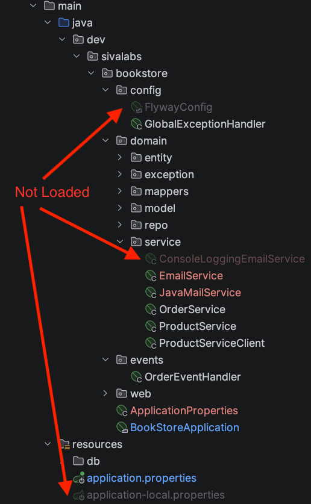
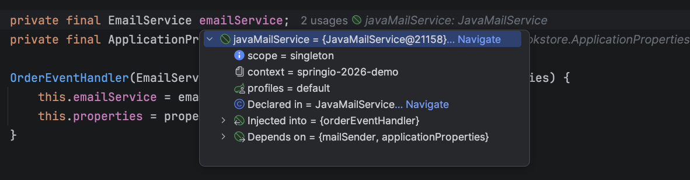
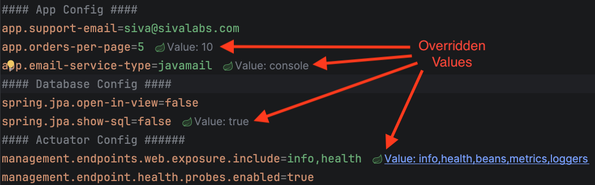

# Skyrocket Developer Productivity with Spring Boot & IntelliJ IDEA

## Prerequisites
* JDK 25+
* [IntelliJ IDEA 2025.3+](https://www.jetbrains.com/idea/)
* Docker & Docker Compose

Install JDK, Maven, Gradle, etc using [SDKMAN](https://sdkman.io/)

```shell
$ curl -s "https://get.sdkman.io" | bash
$ source "$HOME/.sdkman/bin/sdkman-init.sh"
$ sdk install java 25-tem
$ sdk install maven
$ sdk install gradle
```

Pull the following docker images that will be used in the workshop:

```shell
docker pull postgres:18-alpine
docker pull redis:8.4.0
docker pull axllent/mailpit:v1.29
```

## Clone Repositories

```shell
git clone https://github.com/sivaprasadreddy/springio-2026-demo
```

## Spring Debugger Plugin

* Install [Spring Debugger Plugin](https://plugins.jetbrains.com/plugin/25302-spring-debugger)
* Spring Debugger [documentation](https://www.jetbrains.com/help/idea/spring-debugger.html)

### View bean loading status
* Open **springio-2026-demo** project in IntelliJ IDEA
* Start the application in **Debug** mode
* In the package explorer, you should be able to see which beans, properties/yaml files are loaded and which are not.
* Run `BookStoreApplicationTests` with a breakpoint in `contextLoads()` test, then `EmailService` beans should be in YELLOW color indicating mocked beans.



### View beans runtime info
When the application is started in Debug mode, you can view Spring beans runtime info as inlay information.



### View actual property values at runtime
The default application properties defined in application.properties/yml can be overridden by profile-specific config, environment variables, etc.

You can see the actual property values as inlay info in `application.properties/yml`.

* Enable `local` profile and restart the application.
* Set environment variable `APP_ORDERS_PER_PAGE=10`



Click on the actual value to see the source of the overridden value.

### Database connection auto-registration
When the application is started, the Database connections defined in Docker Compose or Testcontainers 
will be automatically detected and registered in the Database tool window.

* No need to manually add Database connections
* No need to map to fixed ports on host and hence avoid port conflicts
* Dynamic port mappings are detected and connections are registered.

Start the application using `BookStoreApplication` to use Docker Compose.
Or, use `TestBookStoreApplication` to use Testcontainers.

### Accessing any Spring bean from the debugger
When you hit a breakpoint, you can access any Spring bean in the ApplicationContext,
not just the beans available within the current scope.

* Access `CacheManager`
* Access `BookRepository`
* Access `EntityManager`
* Access `Environment`

### View/trace database transactions
The current database transaction information can be seen in the debugger.
If there is a parent-child transaction hierarchy, we can navigate to where the transactions started.

Invoke the API endpoint to create a new order:

* Show single Transaction in `OrderService.createOrder()` method.
* Show parent-child transaction hierarchy in `InventoryService.decreaseInventoryLevel()` method.
* Show how `@EventListener` methods run in the same transaction started by the event publisher method.
* Use `@Async`, `@TransactionalEventListener` and `@Transactional(propagation = Propagation.REQUIRES_NEW)`.

**JPA In-memory Pagination issue:**
Invoke the API endpoint to get all orders and show how all Order entities are loaded in L1 cache.

Fix the issue:

Add the property: `spring.jpa.properties.hibernate.query.fail_on_pagination_over_collection_fetch=true`

```java
interface OrderRepository {
    @Query("select o.id from OrderEntity o")
    Page<Long> findOrderIds(Pageable pageable);

    @Query("select o from OrderEntity o join fetch o.items where o.id in (:orderIds)")
    List<OrderEntity> findByIds(List<Long> orderIds);
}


class OrderService {
    @Transactional(readOnly = true)
    public PagedResult<OrderDto> findOrders(int page) {
        Sort sort = Sort.by("id").descending();
        Pageable pageable = PageRequest.of(page - 1, ordersPerPage, sort);
        Page<Long> orderIds = orderRepository.findOrderIds(pageable);
        List<OrderDto> orders = orderRepository.findByIds(orderIds.getContent())
                .stream().map(orderMapper::convertToDto).toList();
        Page<OrderDto> ordersPage = new PageImpl<>(orders, pageable, orderIds.getTotalElements());
        return new PagedResult<>(ordersPage);
    }
}

```

### Remote debugging

Run the application using Docker Compose by enabling remote debugging:

```yaml
services:
  springio-2026-demo:
      image: sivaprasadreddy/springio-2026-demo
      container_name: springio-2026-demo
      environment:
        JAVA_TOOL_OPTIONS: "-agentlib:jdwp=transport=dt_socket,server=y,suspend=n,address=*:5005"
        #...
      ports:
        - "8080:8080"
        - "5005:5005"
```

Connect to the application using **Remote JVM Debug**.

When you hit a breakpoint, you can see the Spring Debugger features available while remote debugging as well.

## Refactoring to Modular Monolith

**Step 1:** Checkout `modulith-start` branch or manually add the following changes:

Add Spring Modulith Test dependency:

```xml
<spring-modulith.version>2.0.3</spring-modulith.version>

<dependencyManagement>
    <dependencies>
        <dependency>
            <groupId>org.springframework.modulith</groupId>
            <artifactId>spring-modulith-bom</artifactId>
            <version>${spring-modulith.version}</version>
            <type>pom</type>
            <scope>import</scope>
        </dependency>
    </dependencies>
</dependencyManagement>

<dependency>
    <groupId>org.springframework.modulith</groupId>
    <artifactId>spring-modulith-starter-test</artifactId>
    <scope>test</scope>
</dependency>
```

Create `ModularityTest`:

```java
import org.junit.jupiter.api.Test;
import org.springframework.modulith.core.ApplicationModules;
import org.springframework.modulith.docs.Documenter;

class ModularityTest {
    static ApplicationModules modules = 
            ApplicationModules.of(BookStoreApplication.class);

    @Test
    void verifiesModularStructure() {
        modules.verify();
        new Documenter(modules).writeDocumentation();
    }
}
```

**Step 2:** Refactor/move code into separate top-level modules(packages)

Checkout `modulith-refactored` branch.

* Show Modules in the Structure tool window
* Show package icons representing open/closed packages/modules
* Show Spring Modulith violations.
* Use IntelliJ quickfixes to resolve them.

## Spring Data Support
IntelliJ IDEA provides reverse engineering capabilities such as:

* Generate entities from existing DB tables.
* Generate Flyway and Liquibase migration scripts from JPA/JDBC entities.
* Create diff scripts for Liquibase and Flyway on model changes. 
* Update JPA/JDBC entities from schema changes

### Generate Flyway migrations from entity changes
In `ProductEntity`, add `category` and `isOutOfStock` fields:

```java
@Column(length = 200)
private String category;

@Column(columnDefinition = "boolean default false")
private boolean isOutOfStock;
```

Generate Flyway Migration from these changes.

### Synchronize DB changes into entities
Add a new Flyway migration with the following script:

```sql
ALTER TABLE products ADD status VARCHAR(50);
```

Restart the application, verify that `status` column is added in `products` table.

Synchronize DB changes using **Create Entity Attributes from DB...** option.

### Spring Data finder method autocompletion 

Create `UserEntity`, `UserRepository` and `UserService`:

```java
@Entity
@Table(name = "users")
public class UserEntity {

    @Id
    @GeneratedValue(strategy = GenerationType.SEQUENCE, generator = "user_id_generator")
    @SequenceGenerator(name = "user_id_generator", sequenceName = "user_id_seq")
    private Long id;
    @Column(unique = true, nullable = false)
    private String email;
    @Column(nullable = false)
    private String password;
    private boolean disabled;
    
}
```

```java
public interface UserRepository extends JpaRepository<UserEntity, Long> {
    
}
```

```java
@Service
public class UserService {
    //inject UserRepository
    
    public UserEntity login(String email, String password) {
        return null;
    }
}
```

* Show Spring Data JPA findBy autocompletion 
* Refactoring Spring Data methods to meaningful method names with `@Query`

### Generate DTO, Spring Data Projections

Generate `UserDto` and Spring Data Projection `UserInfo`
