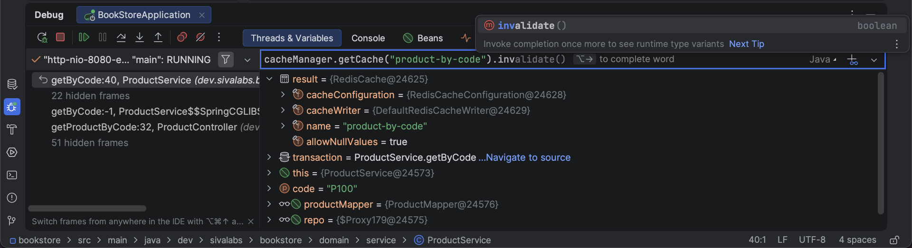
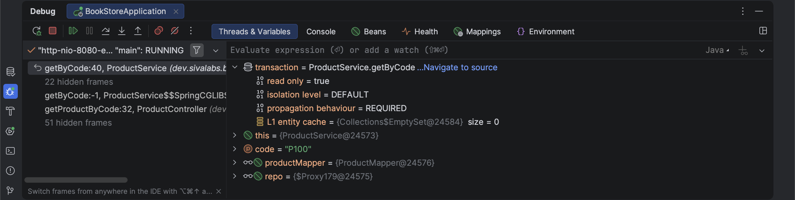
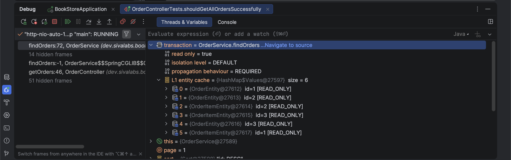
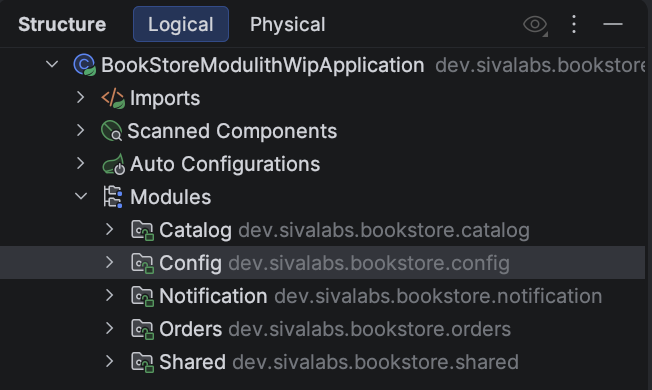
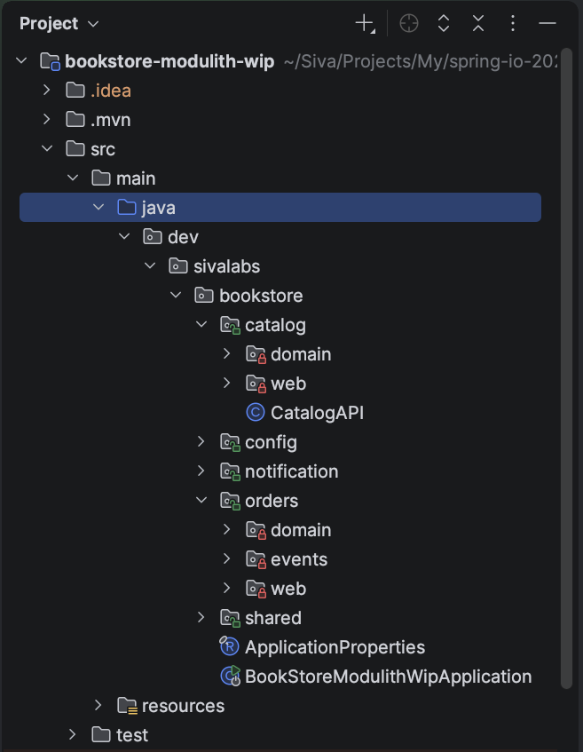
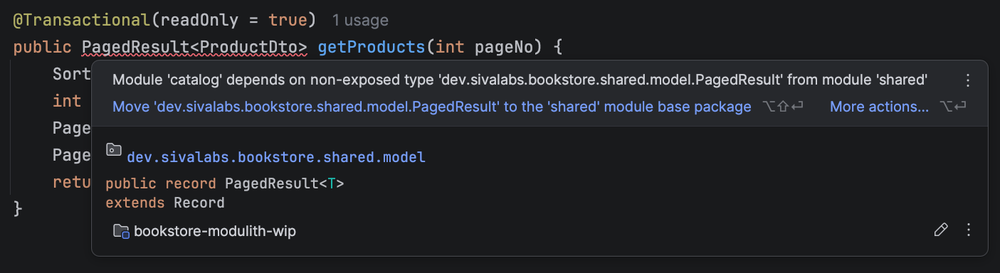
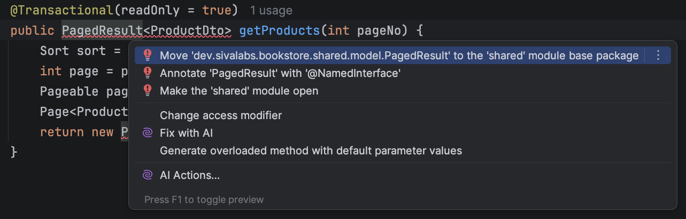

# Skyrocket Developer Productivity with Spring Boot & IntelliJ IDEA

## Table of Contents

1. [Prerequisites](#prerequisites)
2. [Clone Repositories](#clone-repositories)
3. [Local Development with Docker Compose & Testcontainers](#1-local-development-with-docker-compose--testcontainers)
4. [Spring Debugger Plugin](#2-spring-debugger-plugin)
   - [Database Connection Auto-Registration](#database-connection-auto-registration)
   - [View Bean Loading Status](#view-bean-loading-status)
   - [View Actual Property Values at Runtime](#view-actual-property-values-at-runtime)
   - [View Beans Runtime Info](#view-beans-runtime-info)
   - [Accessing Any Spring Bean from the Debugger](#accessing-any-spring-bean-from-the-debugger)
   - [View/Trace Database Transactions](#viewtrace-database-transactions)
   - [Remote Debugging](#remote-debugging)
5. [Refactoring to Modular Monolith](#3-refactoring-to-modular-monolith)
6. [Spring Data Support](#4-spring-data-support)
7. [Kubernetes Deployment](#kubernetes-deployment)

---

## Prerequisites

- JDK 25+
- [IntelliJ IDEA 2025.3+](https://www.jetbrains.com/idea/)
- Docker & Docker Compose

Install JDK, Maven, and Gradle using [SDKMAN](https://sdkman.io/):

```shell
$ curl -s "https://get.sdkman.io" | bash
$ source "$HOME/.sdkman/bin/sdkman-init.sh"
$ sdk install java 25-tem
$ sdk install maven
$ sdk install gradle
```

Pull the Docker images used in this workshop:

```shell
docker pull postgres:18-alpine
docker pull redis:8.4.0
docker pull axllent/mailpit:v1.29
```

## Clone Repository

```shell
git clone https://github.com/sivaprasadreddy/spring-io-2026-intellijidea-workshop
```

Open the **bookstore** project in IntelliJ IDEA.

---

## 1. Local Development with Docker Compose & Testcontainers

Spring Boot 3.1.0 introduced first-class support for Docker Compose and Testcontainers, simplifying both local development and testing:

- `@ServiceConnection` support for commonly used technologies (SQL/NoSQL databases, message brokers, etc.)
- Automatic container lifecycle management with dynamic port allocation
- Simplified integration test setup

**Spring Boot Docs:**
- [Docker Compose Support](https://docs.spring.io/spring-boot/reference/features/dev-services.html#features.dev-services.docker-compose)
- [Testcontainers](https://docs.spring.io/spring-boot/reference/testing/testcontainers.html#testing.testcontainers.service-connections)

### Challenges:

- Fixed ports can cause conflicts when multiple services run on the same machine.
- Registering database connections in DB clients using dynamic ports is tedious to do manually.

---

## 2. Spring Debugger Plugin

1. Install the [Spring Debugger Plugin](https://plugins.jetbrains.com/plugin/25302-spring-debugger).
2. Refer to the [Spring Debugger documentation](https://www.jetbrains.com/help/idea/spring-debugger.html) for full feature details.

### Database Connection Auto-Registration

When the application starts, database connections defined in Docker Compose or Testcontainers are automatically detected and registered in the **Database** tool window.

**Benefits:**
- No need to manually add database connections.
- No need to map fixed ports on the host — dynamic port mappings are detected automatically.

**How to try it:**
- Start the application via `BookStoreApplication` to use Docker Compose.
- Or start via `TestBookStoreApplication` to use Testcontainers.

### View Bean Loading Status

1. Start the application in **Debug** mode.
2. In the **Project** tool window, you can see which beans and property/YAML files are loaded and which are not.
3. Run `BookStoreApplicationTests` with a breakpoint inside the `contextLoads()` test — `EmailService` beans appear in **yellow**, indicating they are mocked.


### View Actual Property Values at Runtime

Property values defined in `application.properties` or `application.yml` can be overridden by profile-specific config files or environment variables. 
The actual resolved values are shown as inlay hints in the properties file.

**How to try it:**
1. Enable `local` profile and set an environment variable `APP_ORDERS_PER_PAGE=10`
2. Restart the application
3. Open `application.properties` — the overridden value appears inline


Click on the displayed value to navigate to the source of the override.

### View Beans Runtime Info

When the application runs in **Debug** mode, Spring bean runtime information is shown as inlay hints directly in the editor.


### Accessing Any Spring Bean from the Debugger

When you hit a breakpoint, you can access any bean from the `ApplicationContext` — not just the beans in the current scope.

**Try accessing these beans from the debugger:**
- `CacheManager`
- `BookRepository`
- `EntityManager`
- `Environment`



### View/Trace Database Transactions

The current database transaction state is visible in the debugger. 
When a parent-child transaction hierarchy exists, you can navigate to where each transaction started.



**How to try it:**

Invoke the API endpoint to create a new order, then set breakpoints to observe:

1. A single transaction inside `OrderService.createOrder()`.
2. A parent-child transaction hierarchy inside `InventoryService.decreaseInventoryLevel()`.
3. How `@EventListener` methods run within the same transaction as the event publisher.
4. How using `@Async`, `@TransactionalEventListener`, and `@Transactional(propagation = Propagation.REQUIRES_NEW)` changes the transaction behavior.

You can view the currently loaded JPA entities and their state.



**JPA In-Memory Pagination Issue:**

Invoke the API endpoint to fetch all orders and observe how all `OrderEntity` instances are loaded into the L1 cache.

Fix by enabling Hibernate's pagination validation:

```properties
spring.jpa.properties.hibernate.query.fail_on_pagination_over_collection_fetch=true
```

Then refactor `OrderRepository` and `OrderService` to use a two-query approach:

```java
interface OrderRepository {

    @Query("select o.id from OrderEntity o")
    Page<Long> findOrderIds(Pageable pageable);

    @Query("select o from OrderEntity o join fetch o.items where o.id in (:orderIds)")
    List<OrderEntity> findByIds(List<Long> orderIds);
}

@Service
class OrderService {

    @Transactional(readOnly = true)
    public PagedResult<OrderDto> findOrders(int page) {
        Sort sort = Sort.by("id").descending();
        Pageable pageable = PageRequest.of(page - 1, ordersPerPage, sort);
        Page<Long> orderIds = orderRepository.findOrderIds(pageable);
        List<OrderDto> orders = orderRepository.findByIds(orderIds.getContent())
                .stream().map(orderMapper::convertToDto).toList();
        Page<OrderDto> ordersPage = new PageImpl<>(orders, pageable, orderIds.getTotalElements());
        return new PagedResult<>(ordersPage);
    }
}
```

### Remote Debugging

To debug the application running inside Docker Compose, enable JDWP in `compose.yml`:

```yaml
services:
  bookstore-layered:
    image: sivaprasadreddy/bookstore-layered
    container_name: bookstore-layered
    environment:
      JAVA_TOOL_OPTIONS: "-agentlib:jdwp=transport=dt_socket,server=y,suspend=n,address=*:5005"
    ports:
      - "8080:8080"
      - "5005:5005"
```

Then create a **Remote JVM Debug** run configuration in IntelliJ IDEA targeting port `5005`.

All Spring Debugger features (bean info, transaction tracing, etc.) are also available during remote debugging sessions.

---

## 3. Refactoring to Modular Monolith

### Step 1: Add Spring Modulith dependencies

Add the BOM and test dependency to `pom.xml`:

```xml
<properties>
    <spring-modulith.version>2.0.3</spring-modulith.version>
</properties>

<dependencyManagement>
    <dependencies>
        <dependency>
            <groupId>org.springframework.modulith</groupId>
            <artifactId>spring-modulith-bom</artifactId>
            <version>${spring-modulith.version}</version>
            <type>pom</type>
            <scope>import</scope>
        </dependency>
    </dependencies>
</dependencyManagement>

<dependencies>
    <dependency>
        <groupId>org.springframework.modulith</groupId>
        <artifactId>spring-modulith-starter-test</artifactId>
        <scope>test</scope>
    </dependency>
</dependencies>
```

### Step 2: Refactor code into top-level module packages

Move code into the following top-level packages:

| Package        | Responsibility                              |
|----------------|---------------------------------------------|
| `shared`       | Cross-cutting models shared across modules  |
| `catalog`      | Product catalog management                  |
| `orders`       | Order processing                            |
| `notification` | Email and notification services             |
| `config`       | Application-wide configuration              |

The refactored code is available in the `bookstore-modulith-wip` project for reference.


### Step 3: Create a modularity verification test

```java
import org.junit.jupiter.api.Test;
import org.springframework.modulith.core.ApplicationModules;
import org.springframework.modulith.docs.Documenter;

class ModularityTest {

    static ApplicationModules modules =
            ApplicationModules.of(BookStoreApplication.class);

    @Test
    void verifiesModularStructure() {
        modules.verify();
        new Documenter(modules).writeDocumentation();
    }
}
```

### Step 4: Leverage Spring Modulith support in IntelliJ IDEA

**What to explore in IntelliJ IDEA:**

- View modules in the **Structure** tool window.



- Observe open/closed package icons that indicate module visibility.



- Review Spring Modulith violations highlighted by the IDE.



- Use IntelliJ quick-fixes to resolve violations.



---

## 4. Spring Data Support

IntelliJ IDEA provides the following Spring Data reverse-engineering capabilities:

- Generate JPA entities from existing database tables.
- Generate Flyway and Liquibase migration scripts from JPA/JDBC entity changes.
- Create diff scripts for Flyway/Liquibase based on model changes.
- Synchronize JPA/JDBC entities from schema changes.

### Generate a Flyway Migration from Entity Changes

Add `category` and `isOutOfStock` fields to `ProductEntity`:

```java
@Column(length = 200)
private String category;

@Column(columnDefinition = "boolean default false")
private boolean isOutOfStock;
```

Use **Generate Flyway Migration** from IntelliJ IDEA to create the corresponding migration script automatically.

### Synchronize Database Changes into Entities

Create a new Flyway migration with the following SQL:

```sql
ALTER TABLE products ADD status VARCHAR(50);
```

Restart the application and verify that the `status` column appears in the `products` table.

Then use the **Create Entity Attributes from DB...** option in IntelliJ IDEA to synchronize the schema change back into `ProductEntity`.

### Spring Data Finder Method Autocompletion

Create `UserEntity`, `UserRepository`, and `UserService`:

```java
@Entity
@Table(name = "users")
public class UserEntity {

    @Id
    @GeneratedValue(strategy = GenerationType.SEQUENCE, generator = "user_id_generator")
    @SequenceGenerator(name = "user_id_generator", sequenceName = "user_id_seq")
    private Long id;

    @Column(unique = true, nullable = false)
    private String email;

    @Column(nullable = false)
    private String password;

    private boolean disabled;
}
```

```java
public interface UserRepository extends JpaRepository<UserEntity, Long> {
}
```

```java
@Service
public class UserService {

    // inject UserRepository

    public UserEntity login(String email, String password) {
        return null;
    }
}
```

**What to explore:**
- Spring Data JPA `findBy` method autocompletion in `UserRepository`.
- Refactoring derived query methods to named queries using `@Query`.

### Generate DTOs and Spring Data Projections

Use IntelliJ IDEA's code generation to create:
- `UserDto` — a plain data transfer object.
- `UserInfo` — a Spring Data projection interface.

---

## Kubernetes Deployment

1. Create a Kind cluster:
   ```shell
   ./deploy/kind/kind-cluster.sh create
   ```
2. Connect to the Kubernetes cluster from the **Services** tool window in IntelliJ IDEA.
3. Load the Docker image into the Kind cluster:
   ```shell
   kind load docker-image sivaprasadreddy/bookstore-modulith --name bookstore
   ```
4. Open the Kubernetes manifests in `deploy/k8s/` and apply them.
5. Port-forward the database port and connect to PostgreSQL from the **Database** tool window.
6. Port-forward to the application and access the API:
   ```
   http://localhost:8080/api/products
   ```
